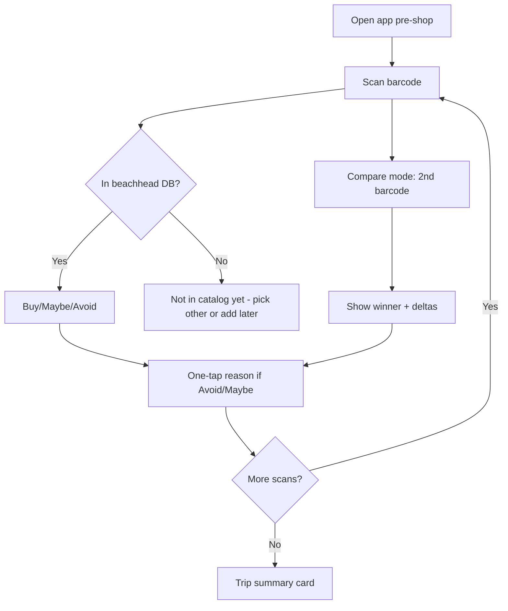

# Rescoped MVP Spec (Bootstrap-Safe)

**Version:** 1.0 post-investor grill  
**Date:** June 28, 2026  
**Build gate:** Concierge W2 retention ≥25% AND barcode hit rate ≥80%

---

## Product promise

**Know what to buy before it goes in the cart** — for cutting shoppers, in protein bars and Greek yogurt only.

---

## Must ship (MVP v1)

| Feature | Description |
|---|---|
| Barcode scan | Camera scan → product lookup in seeded beachhead DB |
| Goal profile | Cutting preset: protein, calories, added sugar, budget sensitivity |
| Buy / Maybe / Avoid | Deterministic rules engine; auditable thresholds |
| Short explanation | Template + cached text per flag (no LLM per scan) |
| Comparison mode | Scan 2 products → goal-based winner + delta summary |
| One-tap reasons | 8 chips after Avoid/Maybe (winner from A/B test) |
| Trip summary | End-of-trip cart audit: counts, sugar/protein delta vs last trip |
| Event logging | Simple JSON events for future aggregation (no B2B dashboard) |

---

## Explicitly deferred

| Feature | Phase | Trigger to revisit |
|---|---|---|
| Voice notes + STT | Phase 2 | A/B shows ≥15% capture lift + ≥10% voice use |
| Label OCR | Phase 2 | Hit rate <70% after manual seeding |
| Packaging / BPA | Phase 3 | Post-retention proof in core categories |
| B2B dashboards | Phase 3 | 10K+ structured events in one category |
| Feedback history beyond last trip | Phase 2 | Subscription paywall test positive |
| All grocery categories | Phase 2+ | 80%+ hit rate in beachhead + W4 retention ≥30% |
| Wearable / glasses UX | Phase 3+ | Not a design constraint until year 2 |
| LLM per-scan explanations | Phase 2 | After PMF; cache-only initially |

---

## User flow (MVP)

---

## Non-goals (unchanged)

- No paid brand placements or score boosts
- No medical claims
- No full-store launch
- No custom hardware

---

## Tech stack (minimal)

| Layer | Choice |
|---|---|
| Mobile | Expo / React Native |
| Backend | Node.js/TypeScript or serverless functions |
| Database | Postgres (products, events, user goals) |
| Product data | Open Food Facts + manual seed list (`data/seed-barcodes.json`) |
| Scoring | Deterministic rules (`scoring/`) — no LLM in hot path |
| Auth | Email or Apple/Google — defer social graph |

---

## Activation & retention targets

| Metric | MVP target |
|---|---|
| First session | 3+ scans, 1+ verdict acted on |
| W1 retention | 25%+ |
| W4 retention | 30%+ (subscription test cohort) |
| Comparison usage | 50%+ of W2 users |

---

## Paywall hypothesis (month 6)

**Free:** 10 scans/trip, 2 comparisons/trip, last trip summary only  
**Paid ($4.99–5.99/mo):** Unlimited comparisons, trip history, category rankings export

Validate in concierge Week 4 before implementing.

---

## Files

- Scoring: [`scoring/`](../scoring/)
- Seed data: [`data/seed-barcodes.json`](../data/seed-barcodes.json)
- Unit economics: [`docs/06-unit-economics.md`](06-unit-economics.md)
- Wedge: [`docs/01-wedge-decision.md`](01-wedge-decision.md)
