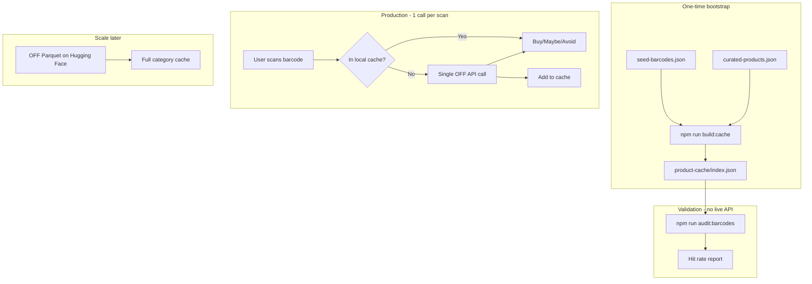

# Open Food Facts Data Strategy

**Why our audit was missing:** We bulk-hit the live JSON API (~200 requests in 90 seconds). OFF explicitly says:

> *"Any attempt to scrape the database using the API will very likely be blocked, as full daily exports are available on this very page."*

> *"You are very welcome to use the API for production cases, as long as **1 API call = 1 real scan by a user**."*

The 16.5% hit rate was mostly **rate limiting and blocking**, not proof that OFF lacks data.

---

## What the OFF data page says (plain English)

| Topic | Rule |
|---|---|
| **License** | Database under Open Database License; contents under Database Contents License; images CC-BY-SA |
| **Bulk data** | Use **nightly exports** (JSONL, MongoDB dump, CSV, Parquet) — not the live API |
| **Live API** | OK for production apps when each call = one user scanning one product |
| **Scraping** | Will get blocked — use static exports instead |
| **Reuse form** | Optional but appreciated — tell OFF how you use the data |

---

## Our compliant approach



### Phase 0 (now): Local cache bootstrap

1. **`data/curated-products.json`** — Hand-verified products for concierge (no API)
2. **`npm run build:cache`** — One-time respectful fetch (2s delay, retries) for seed list
3. **`npm run audit:barcodes`** — Audits **local cache only** (instant, no rate limits)

### Phase 1 (concierge): Live API sparingly

- You manually score via `npm run score` → cache first, live API fallback
- Each concierge scan = 1 API call max (compliant)
- Misses → add to `curated-products.json` or note for OCR

### Phase 2 (MVP app): Same pattern

- Ship with pre-built cache for beachhead categories
- Live API only on cache miss (real user scan)
- User OCR contribution for gaps (OFF's recommended flow)

### Phase 3 (scale): Static export

Use OFF Parquet export for full US protein bar + yogurt coverage:

- [Hugging Face Parquet](https://huggingface.co/datasets/openfoodfacts/product-database)
- Filter by `categories_tags` + `countries_tags`
- No live API needed for bulk enrichment

---

## Commands

```bash
# One-time cache build (respectful; ~7 min for 200 barcodes at 2s delay)
npm run build:cache

# Audit against local cache (correct validation method)
npm run audit:barcodes

# Score single product (cache → live API fallback; 1 call if miss)
npm run score -- 0894700010137
```

---

## Honest hit-rate interpretation

| Audit mode | What it measures |
|---|---|
| ~~Live API bulk~~ | Rate limit / blocking (invalid) |
| **Local cache vs seed list** | Coverage of your **shippable** product database |
| **In-store manual scan** | Real-world hit rate at Target/Kroger (gold standard) |

**80% gate** applies to your **local cache + in-store verification**, not raw OFF API bulk lookup.

If cache hit rate <80% after bootstrap: manual curation + OCR path required before app build (as the investor grill predicted).

---

## Tell OFF about reuse (optional)

When you launch, consider filling their reuse form: you're building a cutting-shopper grocery decision app using OFF as a base product layer with aggregated anonymized feedback — aligned with their contributor model.
